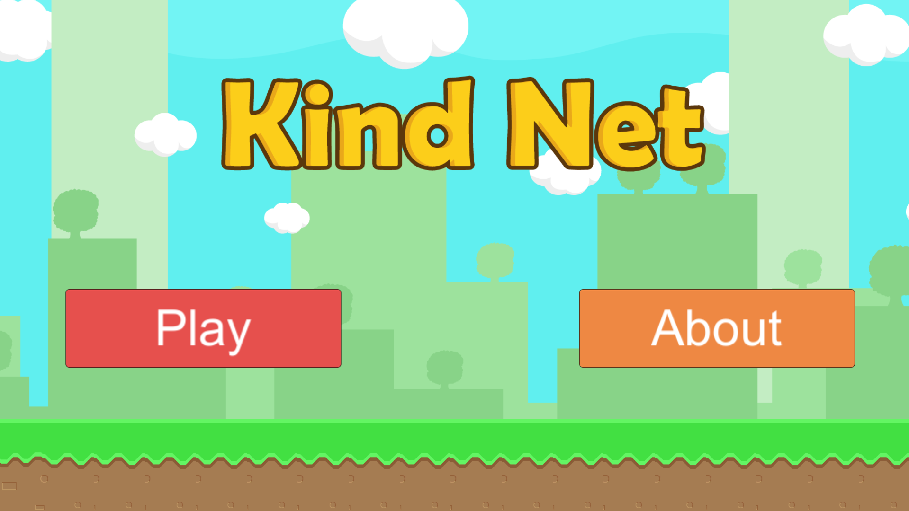
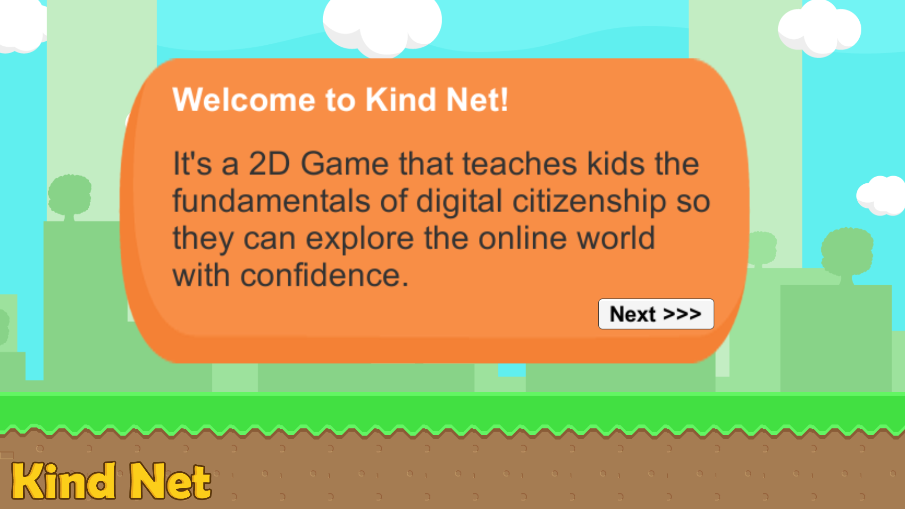
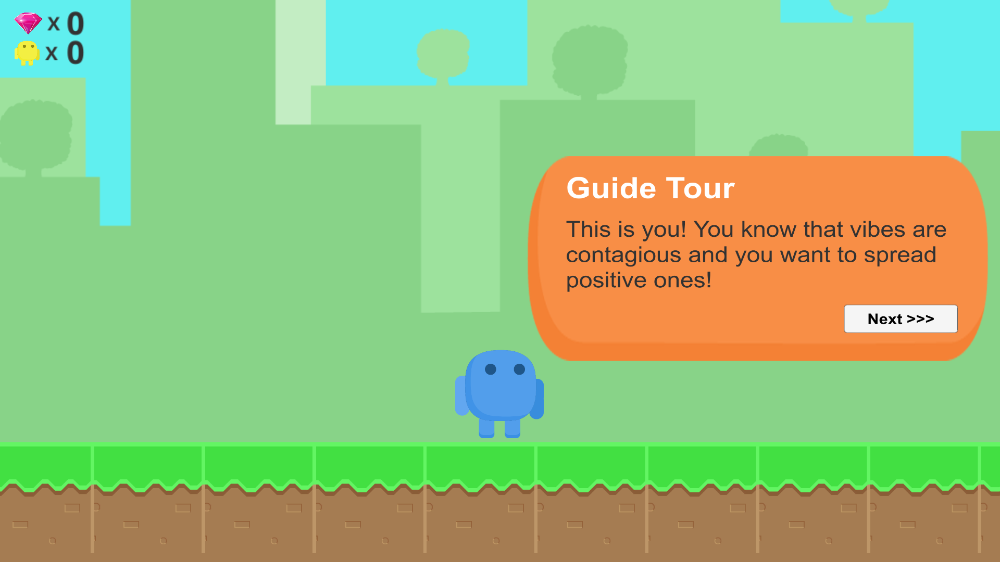
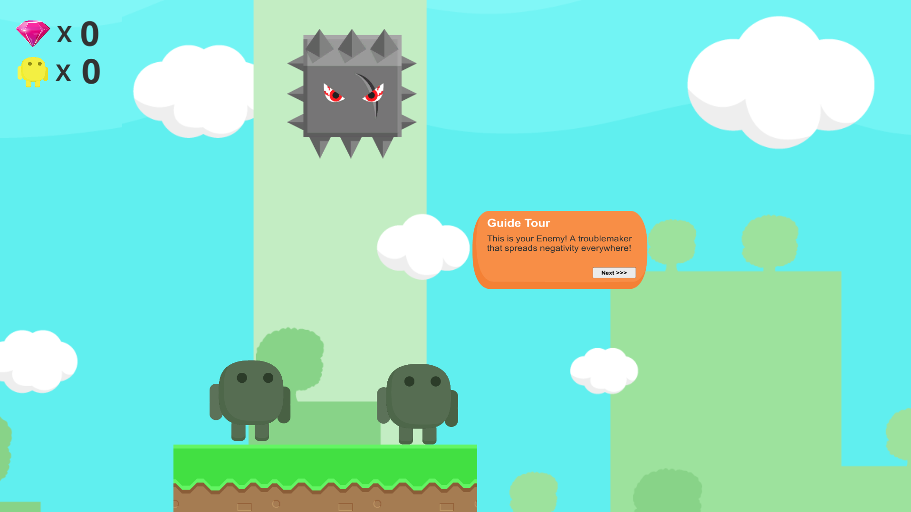
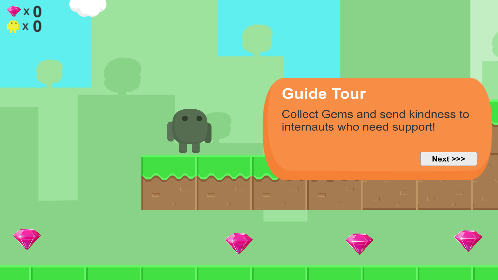
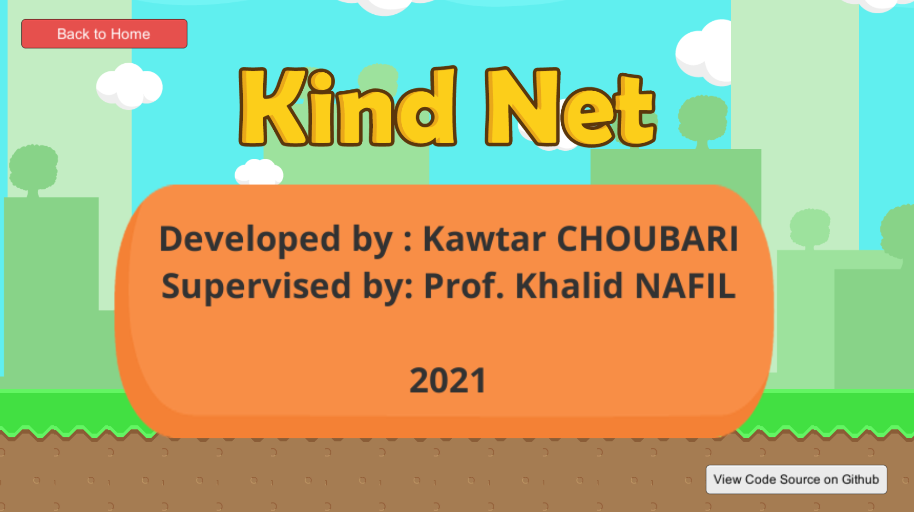

<h1 align="center">Kind Net</h1>

The Power of Online Positivity!

⭐⭐⭐⭐⭐</a>

  

The digital world creates new challenges and opportunities for social interaction, for kids and all the rest of us. Kind Net aims to teach children impacts of Cyberbullying and fighting it by spreading kindness.

  

# :tada: Download:

We hit 10K+ Downloads on PlayStore :

This simple game which was developed as an academic project. Download it and test it via Google Play by clicking the button below. 

 

Or check the [other releases](https://github.com/choubari/Kind-Net/releases).

Ps: I'm not looking to update it with new levels or features.

# Screenshots 

 

  
  
  

---

